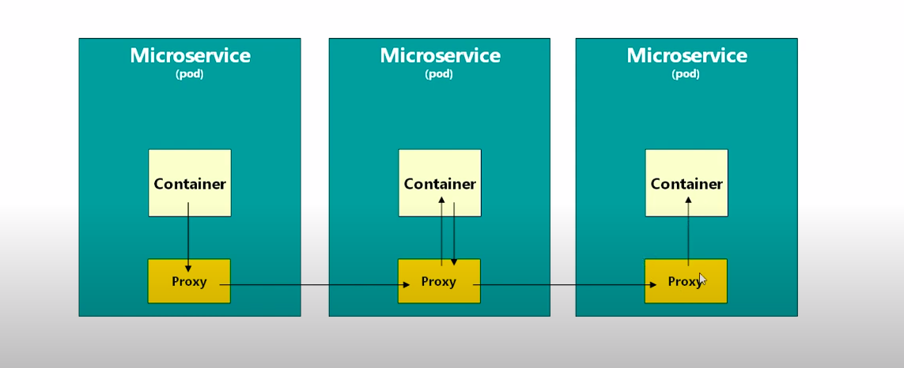
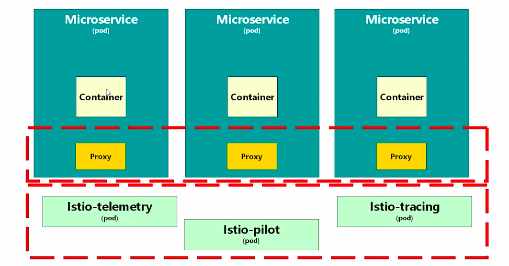

# istio

## What is istio?

 Istio is a service mesh.

 ### What is a service mesh?
 
* ``` In a word a service mesh is an extra layer over your container orchestration platform. ```

From istio's official doc:

```
The term service mesh is used to describe the network of microservices that make up such applications and the interactions 
between them. As a service mesh grows in size and complexity, it can become harder to understand and manage. Its 
requirements can include discovery, load balancing, failure recovery, metrics, and monitoring. A service mesh also often 
has more complex operational requirements, like A/B testing, canary rollouts, rate limiting, access control, and end-to-end 
authentication.

Istio provides behavioral insights and operational control over the service mesh as a whole, offering a complete solution to 
satisfy the diverse requirements of microservice applications.

```

Suppose you're running a good number of pods inside you k8s platform. K8s by default gives you a service discovery mechanism. So you can communicate with any container (pod) from any pods. 

K8s is really a good software to manage the lifecycle of your pods. But incase of the visibility of pod networking, it's still little vague. 

A service mesh is a layer of software that runs with you container (s) inside your pods. Every request comes to the conatiners of a pod via this layer.

The question may arise, why service mesh, why this extra layer of routing? 

The answer is you can write your mesh logic inside this layer. Now the question may arise, why to write extra logic? How may we get faciliated?

- We can generate metrics of network call
- We can add component label security policy, and isolate our business from outer matter and make our code more testable.
- We can trace service label calling and facilitate better auditing.
- We can manage traffic
  
How Istio works?



- Istio adds a proxy container inside your pod.
- Container calls to another pods container through this proxy and another proxy inside that target pod receives that request and sends it to the specific container.
- There's a ``` istio telemetry pod```, ``` Istio pilot pod ``` and a ``` istio tracing pod ``` , deployed by istio in a namespace called istio. They commonly known as control plane.
- All the proxis are known as data plane.
  




https://blog.envoyproxy.io/how-to-write-envoy-filters-like-a-ninja-part-1-d166e5abec09

https://www.youtube.com/watch?v=40gKzHQWgP0

